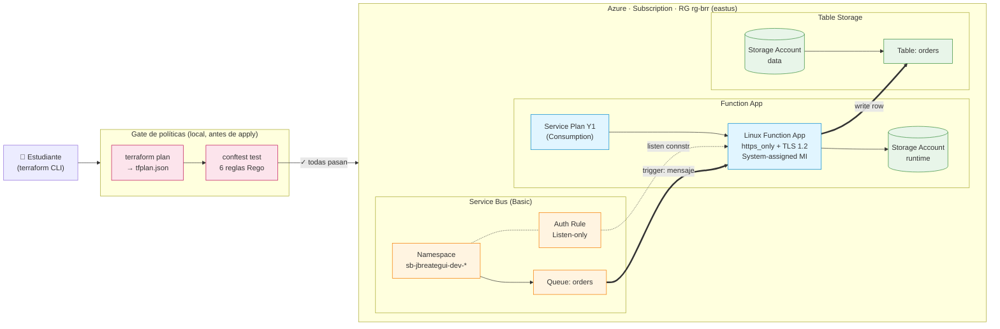

# Tarea — Terraform modular + OPA/Conftest en Azure (Módulo 4 · Clase S03)

**Estudiante:** Juan Breategui (`jbreategui`)
**Repositorio base:** [enterprise-architecture-utec/m04-infra-as-code-s03](https://github.com/enterprise-architecture-utec/m04-infra-as-code-s03)

Entregable: replicar el patrón del lab guiado (Terraform modular + 4 políticas OPA) pero con **otros recursos Azure** y **2 políticas propias adicionales**.

## Stack elegido — Pack "Event-driven serverless"

| Módulo | Recurso principal | SKU | ¿Por qué? |
|--------|-------------------|-----|-----------|
| `service-bus/` | `azurerm_servicebus_namespace` + `azurerm_servicebus_queue` | Basic | El más barato que soporta queues. |
| `function-app/` | `azurerm_service_plan` + `azurerm_linux_function_app` + `azurerm_storage_account` | Y1 (Consumption) | Pago por ejecución (~$0 idle). |
| `table-storage/` | `azurerm_storage_account` + `azurerm_storage_table` | Standard LRS | Free 5 GB en cuenta de estudiante; sink NoSQL barato. |

**Flujo de la app:** mensaje en cola → Function lo procesa → escribe fila en Table Storage. La Function autentica vía **Managed Identity** y consume `connection_string` (Listen-only) del Service Bus y connection string del Storage como app settings.

> **Nota histórica:** el módulo originalmente era `cosmos-db/`, pero la suscripción del lab no tiene region access para Cosmos en `eastus` (la única región permitida por su Azure Policy). Se pivotó a Table Storage manteniendo el patrón event-driven.

## Diagrama de arquitectura



### Vista ASCII (fallback)

```
   estudiante
      │
      ▼
  ┌─────────────────────────────────┐
  │  terraform plan → conftest      │  ← gate: 6 políticas Rego
  │  (NO apply hasta que pase)      │
  └────────────┬────────────────────┘
               │ ✓
               ▼
  ╔══════ Azure · RG rg-brr (eastus) ══════╗
  ║                                         ║
  ║  ┌─────────────┐  listen connstr        ║
  ║  │ Service Bus │──────────────┐         ║
  ║  │  (Basic)    │              │         ║
  ║  │  queue:     │   trigger    ▼         ║
  ║  │  orders     │========►┌────────────┐ ║
  ║  └─────────────┘         │  Function  │ ║
  ║                          │  App (Y1)  │ ║
  ║                          │  https+MI  │ ║
  ║                          └─────┬──────┘ ║
  ║                                │write   ║
  ║                                ▼        ║
  ║                          ┌────────────┐ ║
  ║                          │   Table    │ ║
  ║                          │  Storage   │ ║
  ║                          │  (orders)  │ ║
  ║                          └────────────┘ ║
  ╚═════════════════════════════════════════╝
```

### Componentes y su rol

| Componente | Módulo Terraform | Rol |
|------------|------------------|-----|
| Service Bus namespace + queue | `modules/service-bus/` | Buffer de eventos. Auth rule con permiso `Listen` only para la Function. |
| Function App (Linux, Y1) | `modules/function-app/` | Compute serverless. Consumo del queue, escritura a Table. HTTPS only, TLS 1.2, MI system-assigned. |
| Storage Account "runtime" | `modules/function-app/` | Requerido por Azure Functions para state interno (host, leases, etc.). |
| Storage Account "data" + Table | `modules/table-storage/` | Sink NoSQL de la app. SA separado para no mezclar runtime con datos de negocio. |
| Conftest + 6 reglas Rego | `policy/` | Gate **local** antes de `apply`: tags, secure storage, SKU, location, https/tls compute, managed identity. |

## Políticas OPA — 4 base + 2 nuevas

| # | Archivo | Origen | Qué valida |
|---|---------|--------|------------|
| 1 | `azure_required_tags.rego` | base s03 | 4 tags obligatorias. |
| 2 | `azure_storage_secure.rego` | base s03 | TLS 1.2, sin blobs públicos, HTTPS only. |
| 3 | `azure_function_sku.rego` | **adaptada** | Service Plan ∈ {Y1, B1}. |
| 4 | `azure_location.rego` | base s03 | Sólo `eastus`/`eastus2`/`westus2`. |
| 5 | `azure_compute_https_tls.rego` | **NUEVA** | Function App: HTTPS only + TLS 1.2 + FTPS off. |
| 6 | `azure_managed_identity.rego` | **NUEVA** | Function App: `SystemAssigned` MI obligatoria. |

Detalle en [`policy/README.md`](policy/README.md).

## Estructura

```
clase4/
├── README.md                          ← este archivo
├── modules/
│   ├── service-bus/
│   │   ├── main.tf
│   │   ├── variables.tf
│   │   └── outputs.tf
│   ├── function-app/
│   │   ├── main.tf
│   │   ├── variables.tf
│   │   └── outputs.tf
│   └── table-storage/
│       ├── main.tf
│       ├── variables.tf
│       └── outputs.tf
├── environments/dev/
│   ├── providers.tf
│   ├── main.tf
│   ├── variables.tf
│   ├── outputs.tf
│   ├── terraform.tfvars               ← ajustar RG asignado
│   └── README.md
└── policy/
    ├── README.md
    ├── azure_required_tags.rego
    ├── azure_storage_secure.rego
    ├── azure_function_sku.rego
    ├── azure_location.rego
    ├── azure_compute_https_tls.rego   ⭐ nueva
    └── azure_managed_identity.rego    ⭐ nueva
```

## Prerrequisitos

| Herramienta | Versión mínima |
|-------------|----------------|
| Terraform | >= 1.5.0 |
| Azure CLI | >= 2.50 |
| Conftest | >= 0.46 |

## Flujo de ejecución

```powershell
# 1. Autenticarse
az login
az account set --subscription "<tu-subscription-id>"

# 2. Editar el RG asignado y tags en environments/dev/terraform.tfvars

# 3. Plan + validación de políticas
Set-Location environments\dev
terraform init
terraform validate
terraform plan -out=tfplan
terraform show -json tfplan > tfplan.json
conftest test --policy ..\..\policy tfplan.json

# 4. Apply (sólo si conftest pasa)
terraform apply tfplan

# 5. Verificar outputs
terraform output

# 6. Limpieza al finalizar
terraform destroy
```

> ⚠️ **Importante**: ejecutar `terraform destroy` al terminar para no acumular costos. El destroy sólo afecta los recursos creados por este state — el RG asignado por el docente **no se borra** (es un `data` source, no se gestiona desde acá).

## Decisiones de diseño

1. **`data "azurerm_resource_group"`, no `resource`**: el RG lo asigna el docente, no se crea ni se borra desde Terraform.
2. **`random_string` como sufijo** en `local.name`: garantiza unicidad global (Storage exige nombres únicos en Azure).
3. **`listener_connection_string` (Listen-only)** en vez de la `RootManageSharedAccessKey`: principio de menor privilegio.
4. **Storage Account separado para datos**: la Function tiene su propio SA de runtime; la tabla vive en un SA distinto (`table-storage/`) para no mezclar concerns.
5. **Managed Identity en Function App**: habilita migrar a auth sin secretos asignando rol `Storage Table Data Contributor` al MI (en vez de usar el connection string actual).

## Verificación de las políticas

Cada `.rego` se puede probar invirtiendo intencionalmente una propiedad (ver tabla en [`policy/README.md`](policy/README.md)) y reejecutando `terraform plan` + `conftest test`. Cada cambio debe disparar **exactamente** el `deny` esperado.
